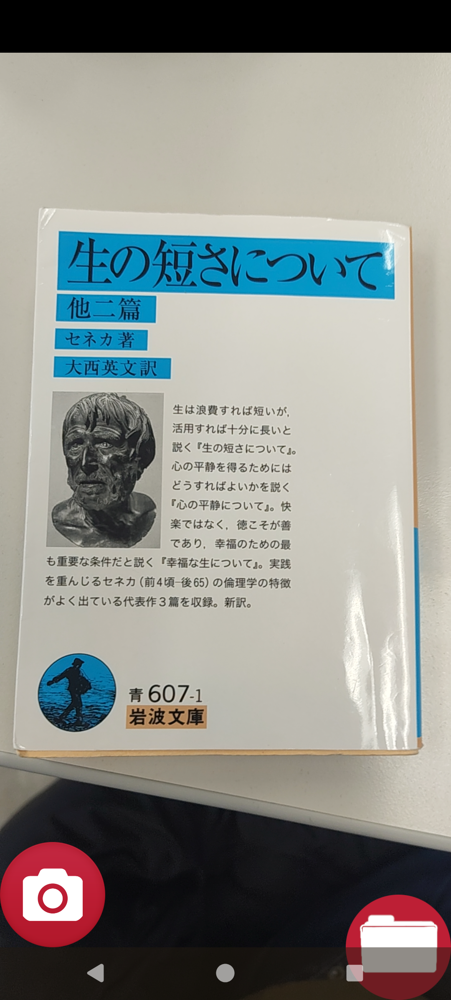
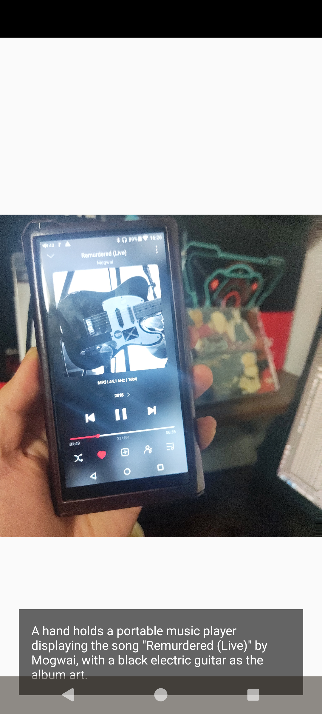

Camera2Basic-WithAI
===========================
A horrible Android AI app that do Image recognization stuff that AI image recognization stuff.
I've made this app only because it's part of a college homework, and what a massive pain in the butt to making this.
Even with decyphering English documentation, help of AIs, it took a few weeks to make this nonsense.

Introduction
------------

The [Camera2 API][1] allows users to capture RAW images, i.e. unprocessed pixel data
directly from the camera sensor that has not yet been converted into a format and
colorspace typically used for displaying and storing images viewed by humans.  The
[DngCreator][2] class is provided as part of the Camera2 API as a utility for saving
RAW images as DNG files.

This project incoporates that, but with androidx.activity:activity:1.7.0, androidx.activity:activity-compose:1.7.0 to load images, and Firebase and Gemini APIs to proccessing image recognization to do job for AI.

Note: I removed Camera2AI/app/google-services.json due to security concern. If you want to use that, fetch it and add it yourself by look up Firebase API stuff tutorial if you want to use this repository for your own needs.

This sample displays a live camera preview in a TextureView, and saves JPEG and DNG
file for each image captured.

[1]: https://developer.android.com/reference/android/hardware/camera2/package-summary.html
[2]: https://developer.android.com/reference/android/hardware/camera2/DngCreator.html

I tested app on...
------------
- Nothing Phone 3a (Android 16, Camera and File Manager worked)
- FiiO M15 (Android 7, File Manager worked)

Pre-requisites
--------------

- Android SDK 29+
- Android Studio 3.5+
- Firebase API project pre-requisites in general (firebase.google.com/docs/ai-logic/get-started?platform=android)

Screenshots
-------------

 
 

Getting Started
---------------

This sample uses the Gradle build system. To build this project, use the
"gradlew build" command or use "Import Project" in Android Studio.
